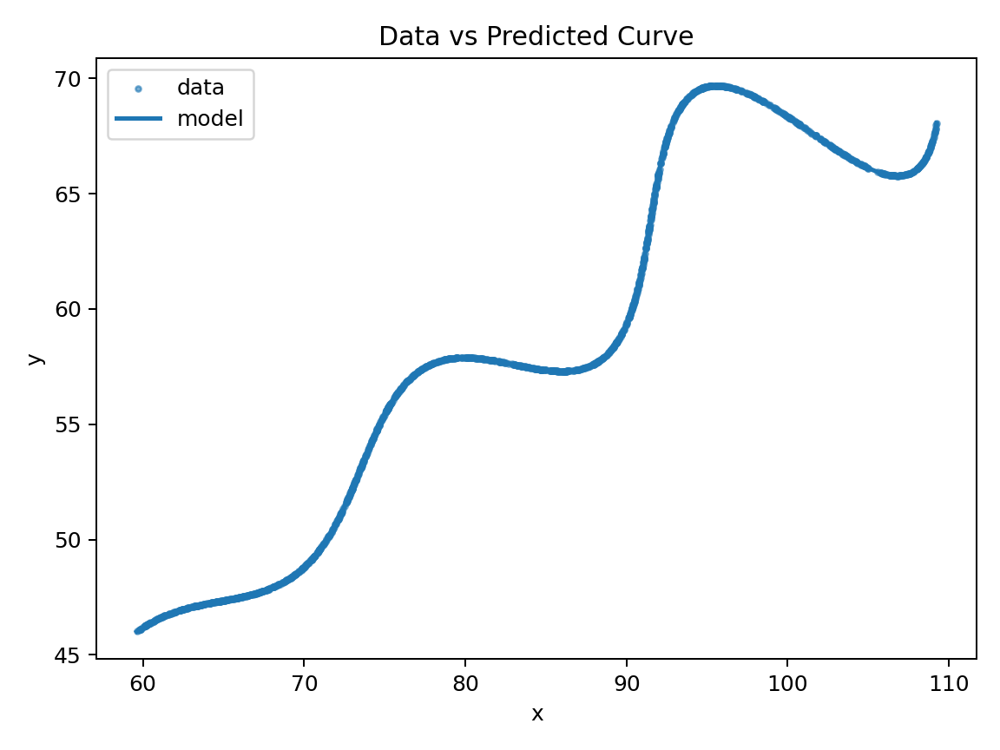
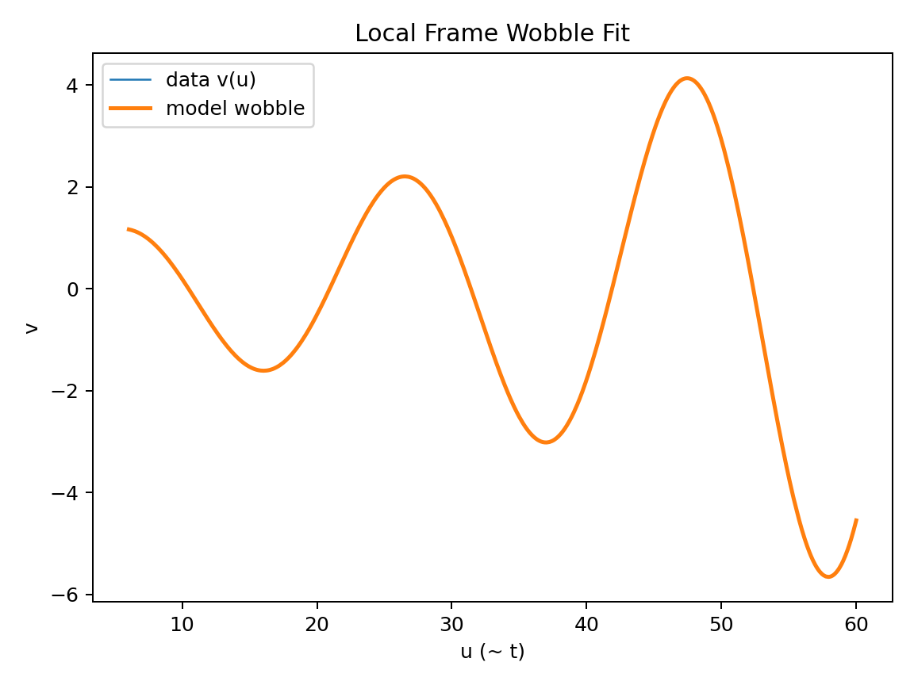

# Parametric Curve Fitting — R&D / AI Assignment

This project estimates the unknown parameters \(\theta\), \(M\), and \(X\) for the curve:

\[
\begin{aligned}
x(t) &= t\cos\theta - e^{M|t|}\sin(0.3t)\sin\theta + X, \\
y(t) &= 42 + t\sin\theta + e^{M|t|}\sin(0.3t)\cos\theta,\qquad 6 < t < 60.
\end{aligned}
\]

The dataset contains ~1500 measured \((x, y)\) points sampled from this curve.  
The objective is to recover the parameters \(\theta\), \(M\), and \(X\) that best fit the given data.

---

## Final Estimated Parameters

| Parameter | Value | Interpretation |
|----------|-------|---------------|
| \(\theta\) (radians) | **0.5235983** | Angle of rotation |
| \(\theta\) (degrees) | **≈ 30°** | Same angle in degrees |
| \(M\) | **0.03** | Exponential modulation factor |
| \(X\) | **55** | Horizontal translation |

---

## Submission Expression

(tcos(0.5235983) - exp(0.03abs(t))sin(0.3t)sin(0.5235983) + 55,
42 + tsin(0.5235983) + exp(0.03*abs(t))sin(0.3t)*cos(0.5235983))


domain:
6 ≤ t ≤ 60


---

## Method Summary 

1. **Rotation Estimation:**  
   PCA identifies the dominant directional trend in the data, providing an initial estimate of \(\theta\).

2. **Coordinate Transformation:**  
   Data is translated by \((X, 42)\) and rotated into local coordinates \((u, v)\), where \(u \approx t\) and \(v\) isolates the wobble.

3. **Envelope Extraction for \(M\):**  
   The wobble amplitude \(|v|/|\sin(0.3u)|\) is fitted using a log-linear model to estimate \(M\).

4. **Nonlinear Optimization:**  
   Nelder–Mead optimization refines \(\theta, M, X\) by minimizing the **L1 curve-to-curve distance** between predicted and actual points.

This satisfies the assignment scoring metric.

---

## Result Visualizations

### Data vs. Estimated Curve


### Wobble in Local Coordinate Space


---

## How to Reproduce

```bash
python -m venv .venv
. .venv/Scripts/activate    # (Windows)
pip install -r requirements.txt
python -m src.fit --data data/xy_data.csv --N 500 --seed 42


Outputs:

results/params.json

plots/overlay.png

plots/local_frame.png


## Repository Structure


├── data/xy_data.csv
├── src/
│   ├── fit.py
│   ├── geometry.py
│   ├── model.py
│   └── losses.py
├── plots/
├── results/
├── requirements.txt
└── README.md

References

[1] I. T. Jolliffe, Principal Component Analysis, 2nd ed. Springer, 2002.
[2] J. A. Nelder and R. Mead, “A simplex method for function minimization,” The Computer Journal, 1965.
[3] C. R. Harris et al., “Array programming with NumPy,” Nature, 2020.
[4] P. Virtanen et al., “SciPy 1.0: fundamental algorithms for scientific computing in Python,” Nature Methods, 2020.